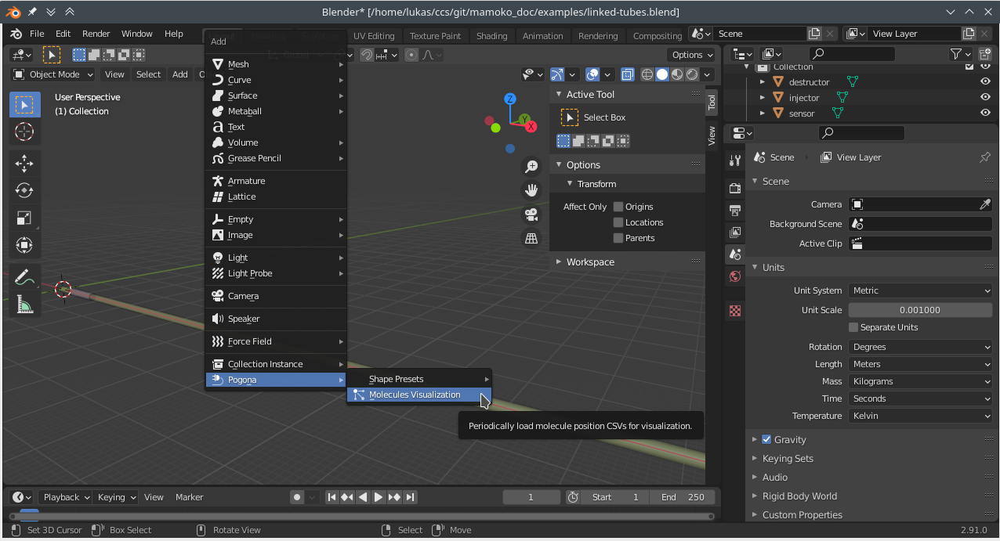
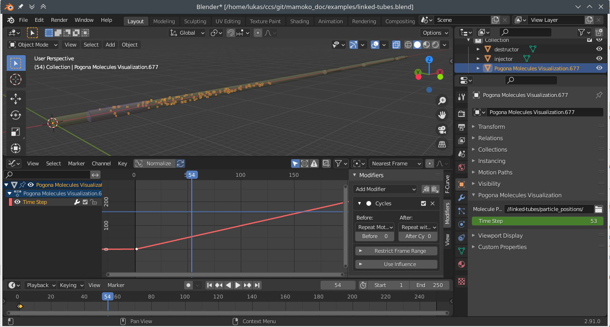
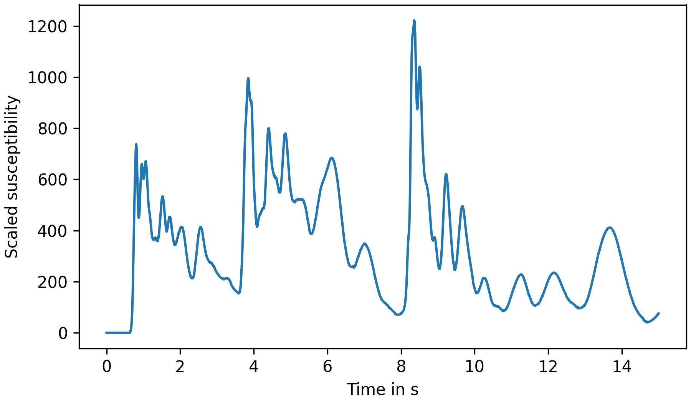

.. _running:

Running a Simulation
====================

Continuing the example of the previous chapters, ``cd`` into the folder containing your ``linked-tubes.conf.yaml``.
Then you can run the following command to start the simulation:

.. code-block:: bash

    pogona --config linked-tubes.conf.yaml --openfoam-cases-path ~/pogona-openfoam-cases --results-dir ./sim-result/

This command assumes that you have a copy of (or a symbolic link to) the Pogona OpenFOAM cases in your home directory in a sub-folder named ``pogona-openfoam-cases/``.
Output files such as the simulation log, particle positions, and sensor values will be written to ``sim-result/``.

Inspecting Particle Traces With Blender
---------------------------------------

Open the Blender project you created for the :ref:`scene configuration <scene_config>`.
With the cursor at the world origin, insert a Pogona Molecules Visualization (Add > Pogona > Molecules Visualization).

    Blender Screenshot: Adding a Pogona Molecules Visualization.

Then, in the Object Properties under Pogona Molecules Visualization, set the Molecule Positions Path to the ``--results-dir`` specified above and the ``particle_positions`` folder within, e.g.: ``//sim-result/particle_positions/``.

If you now change the value of the Time Step in the same properties panel, you should see vertices appearing in the scene at the positions of simulated particles.
This will also work while the simulation is still running, as the add-on will check for newly added CSV files in the Molecule Positions Path every time the Time Step is updated.
In order to better see the particles inside the opaque tubes, you can enable the X-Ray setting in the Viewport Shading panel.

Next, we'll animate the Time Step.
There are at least two approaches you can use:

1. Animating the Time Step with a Driver
^^^^^^^^^^^^^^^^^^^^^^^^^^^^^^^^^^^^^^^^

Using `drivers <https://docs.blender.org/manual/en/latest/animation/drivers/usage.html>`_ is probably the easiest way to animate the Time Step.

Enter ``#frame`` into the Time Step field to create a driver based on the index of the current frame.
This will give you a 1-to-1 correspondence between frame number and simulation step.
If you want to play back the simulation faster, you can right click on the Time Step field and select "Edit Driver".
Here, you can edit the driver expression, for example, and multiply the frame number with a constant factor.
For real-time playback, multiply by the formula below.

2. Animating the Time Step with Key Frames
^^^^^^^^^^^^^^^^^^^^^^^^^^^^^^^^^^^^^^^^^^

This approach can give you more flexibility.
For example, you can slow down the playback at the time when particles are first injected and then speed it up for the rest of the simulation.

Add a key frame for the Time Step property both in the first and second frame.
Then open a Graph Editor window and press N to open the right-hand side panel.
Now, select the second key frame and, assuming we want real-time playback, set its value to :math:`\frac{1}{\text{base_delta_time}\;\cdot\;\text{frame_rate}}`.
With our current settings, this would amount to :math:`\frac{1}{0.005\text{ s}\;\cdot\; 24\text{ Hz}} \approx 8.333`.

    Blender Screenshot: Key frame settings and animated particles.

Then, in the Modifiers tab of the side panel, add a new Cycles modifier and set the After cycling mode to Repeat with Offset.
When you now play back the animation, the particle positions should update automatically at the correct speed.

Sensor Output
-------------

In your simulation output directory, you should find a file ``sensor_data/sensor[sensor].csv``.
The name in brackets corresponds to the name of the component in ``linked-tubes.config.yaml``.

    .. code-block::

        sim_time,rel_susceptibility
        0.0,0
        0.005,0
        0.01,0
        0.015,0
        […]
        1.445,422.85906514362125
        1.45,429.7742873910414
        1.455,441.20024293735077
        1.46,452.27608305378936
        1.465,458.61007022577684
        1.47,468.54307148207323
        1.475,478.13429971112623
        […]

You may use any tools of your preference for further processing of these output files.
Using Pandas and Matplotlib for plotting might look like this, for example:

    .. literalinclude:: ../../examples/linked-tubes/plot.py
        :language: python
        :linenos:

    Plot of sensor response over time.
