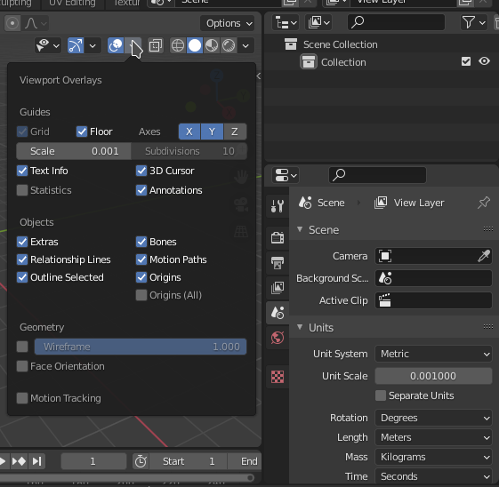
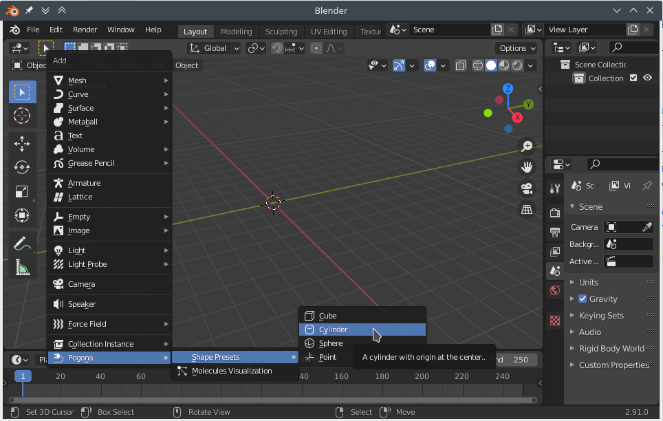
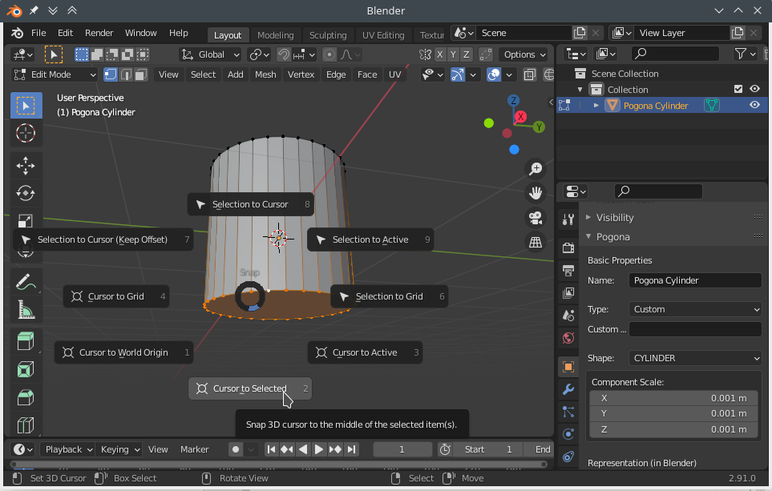
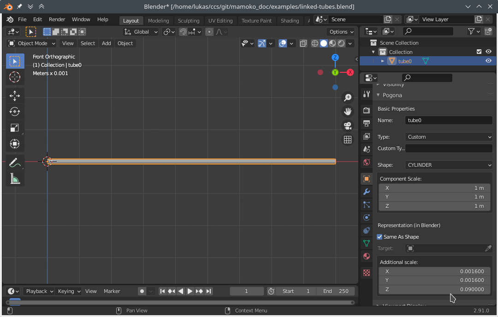
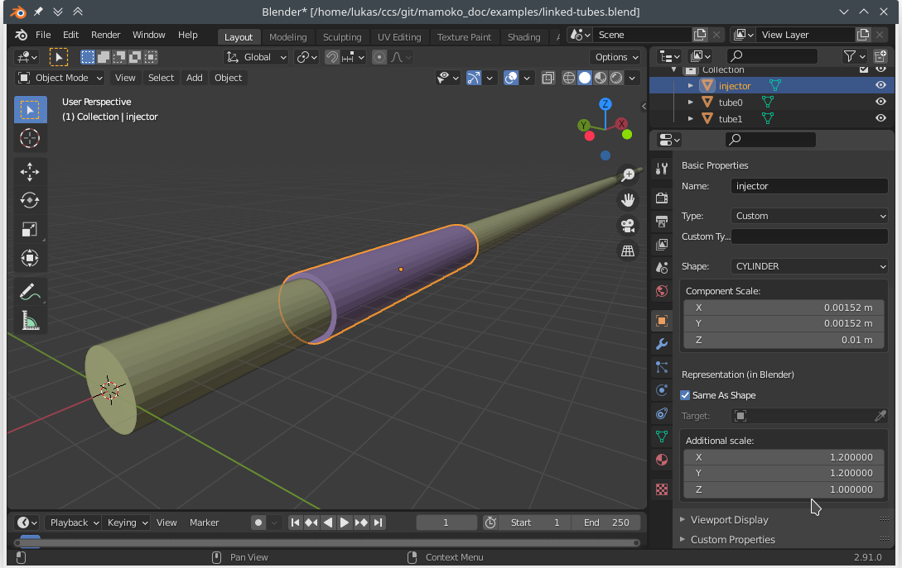
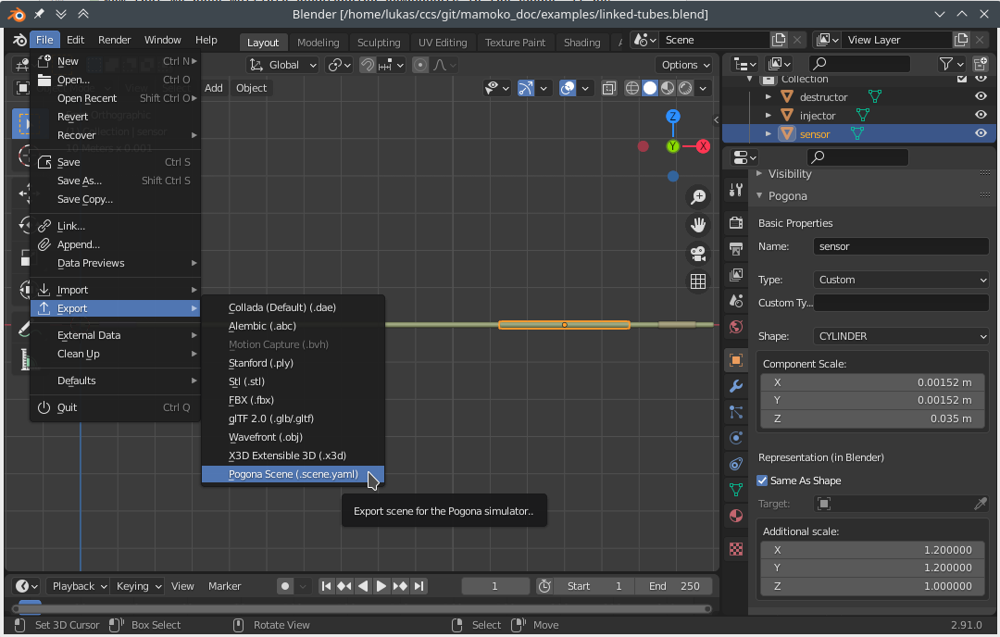

.. |nbsp| unicode:: 0xA0
   :trim:

.. _scene_config:

Scenes
======

Each Pogona simulation is configured with the help of at least one configuration file in YAML format.
To make things simpler, we will consider the configuration of the *scene* (i.e., where instances of :class:`~pogona.Object`, :class:`~pogona.Sensor`, etc. are located in 3D space) and :ref:`configuration of the simulation behavior <configuration>` separately.

Using Blender to Configure a Scene
----------------------------------

The first step is to install the Pogona Blender add-on.
For instructions and a download, head over to the `add-on repository <https://github.com/tkn-tub/pogona-blender>`_.

Adding Components
^^^^^^^^^^^^^^^^^

Start with an empty scene.
In this example, we will create a very simple scenario of two linked straight tubes.
Linking vector field objects together is a useful feature for avoiding the scale of CFD simulations in OpenFOAM growing out of hand.

To make your life easier in the following steps, make sure that Blender's unit scale is set correctly before doing anything else.
To do this, go to the Scene Properties and then, in the Units panel, choose Metric as the Unit System and set the Unit Scale to 0.001.
This will let us work on a millimeter scale in Blender, which is especially useful when we add Pogona shape presets later.
(Hint: If you are missing Blender's grid lines, you can set the scale of the grid also to 0.001 in the Viewport Overlays panel in the 3D Viewport.)

    Blender Screenshot: Setting the scale of the scene.

We'll start with positioning the first :class:`~pogona.objects.ObjectTube`.
The Pogona Blender add-on does not provide a preset representation of this object, but we can create our own visualization of a tube and we will still be able to export its position, rotation, and scale for the simulation configuration.
Start by selecting Add > Pogona > Shape Presets > Cylinder in the 3D Viewport.

    Blender Screenshot: Adding a component to the scene.

You should now see a 1 |nbsp| mm tall cylinder with a diameter of 1 |nbsp| mm centered around the origin of the scene.
The reason that the cylinder's origin is located in its center of mass is because it matches the definition of :class:`~pogona.Shapes`, which are used for the :class:`~pogona.Sensor` class and its subclasses, for example.

However, in this instance we want to represent an :class:`~pogona.objects.ObjectTube`, which is defined to originate at its inlet.
To fix the cylinder we just inserted, enter Blender's Edit Mode (e.g., by selecting the cylinder and pressing the Tab key on the keyboard).
Select the *bottom* circle of vertices (e.g., by keeping the Alt key pressed while clicking on one of the circle's edges).
Then press Shift+S and select Cursor to Selected.

    Blender Screenshot: Changing the origin of the tube.

Now you can leave Edit Mode (Tab) and select Object > Set Origin > Origin to 3D Cursor.
You may notice that after this operation, the reported location of the object has changed to -0.5 |nbsp| mm on the Z axis.

Even though we will not simulate gravity in this example, in order to make better use of horizontal screen space, we will rotate our tube by 90 degrees around the Y axis and move it to the scene origin.

Now open the Object Properties and find the Pogona panel, where you will find some important settings for our simulation scenario:

:Name:
    The name of our tube.
    This is how we will refer to this object in the remainder of the configuration, so let us set it to something recognizable like "tube0".
:Type: (Currently not used.)
:Shape:
    Since we added a Cylinder preset shape, this is already set to the value we want.
    If you have OpenFOAM simulation files for a custom shape (e.g., a Y-piece) and you also have a CAD model available in Blender, you can uncheck **Same As Shape** and set **Target** to your CAD model to be used in the stead of the shape setting.
:Component Scale:
    This scaling vector is applied to the component as a whole in the Pogona simulation, which is useful, e.g., for sensors that use some of the preset shapes like a cylinder.
    However, usually OpenFOAM results are already scaled correctly internally, which also applies to the :class:`~pogona.objects.ObjectTube` we are in the process of including.
    Therefore, *make sure that the Component Scale of the tube is set to the unit vector*!
:Additional Scale:
    After having set the scale of the tube to the unit vector, you will have noticed that the visual representation of the tube is now much larger than what we expect the vector field to be.
    We can fix this by entering the real scale of the tube into Additional Scale, which only affects the visualization but not the simulation.
    Set this to (0.00152, |nbsp| 0.00152, |nbsp| 0.09) for a 9 |nbsp| cm long tube with a radius of 0.76 |nbsp| mm.

    Blender screenshot: Configuration of ``tube0``.

Next, we can add our second tube to make the channel longer.
Simply duplicate ``tube0`` by pressing Shift+D, then move it by 8 |nbsp| cm on the X axis.
This gives us a buffer of 1 |nbsp| cm at the end of ``tube0``, within which a particle can be detected as being in the process of leaving the tube in order to be handed over to the next.
We will configure this buffer zone in the :ref:`configuration of the simulation behavior <configuration>`.
Rename the new object to ``tube1``.

This completes the setup of the channel.
Next, we need a way to inject particles into this channel.
Add a new Pogona Cylinder shape, leave its origin at its center this time, rotate it 90 degrees around Y to align with ``tube0``, set its component scale to (0.00152, |nbsp| 0.00152, |nbsp| 0.01), move it to (0.01, |nbsp| 0, |nbsp| 0), and name it ``injector``.

Now that we have multiple overlapping components in the scene, it becomes hard to visually distinguish these components.
To some extent, this can be helped by giving each component a different color.
However, since the ``injector`` overlaps exactly with the tube, you may see some z-fighting-induced flicker when moving around the viewport.
In such cases, you may find it useful to increase the 'additional scale' of one component but not the other.
As mentioned above, this will not affect the simulation itself, which in this case means that no particles will be spawned outside of ``tube0`` even if the ``injector`` *looks* as if it had a larger diameter than ``tube0``.

    Blender screenshot: Configuration of the ``injector``.

Let us assume the particles in our channel are superparamagnetic iron oxide nanoparticles (SPIONs) and we want to measure the magnetic susceptibility induced by the particles moving through a section of our channel.
Add another cylinder with the same radius as the tube, move it to :math:`x=13\text{ cm}`, and name it ``sensor``.
The length of this ``sensor`` will depend on the physical sensor we want to simulate.
We will use ``ERLANGEN_20200310`` of :class:`~pogona.KnownSensors`, which expects a cylinder 35 |nbsp| mm in length.

Lastly, add yet another cylinder in the channel somewhere after the ``sensor`` and name it ``destructor``.
This component will delete all particles that we already measured and that we don't need to simulate anymore

Exporting the Configuration
^^^^^^^^^^^^^^^^^^^^^^^^^^^

    Blender screenshot: Exporting the scene configuration.

To export the scene, click File > Export > Pogona Scene.
Save the exported scene as ``linked-tubes.scene.yaml``.
