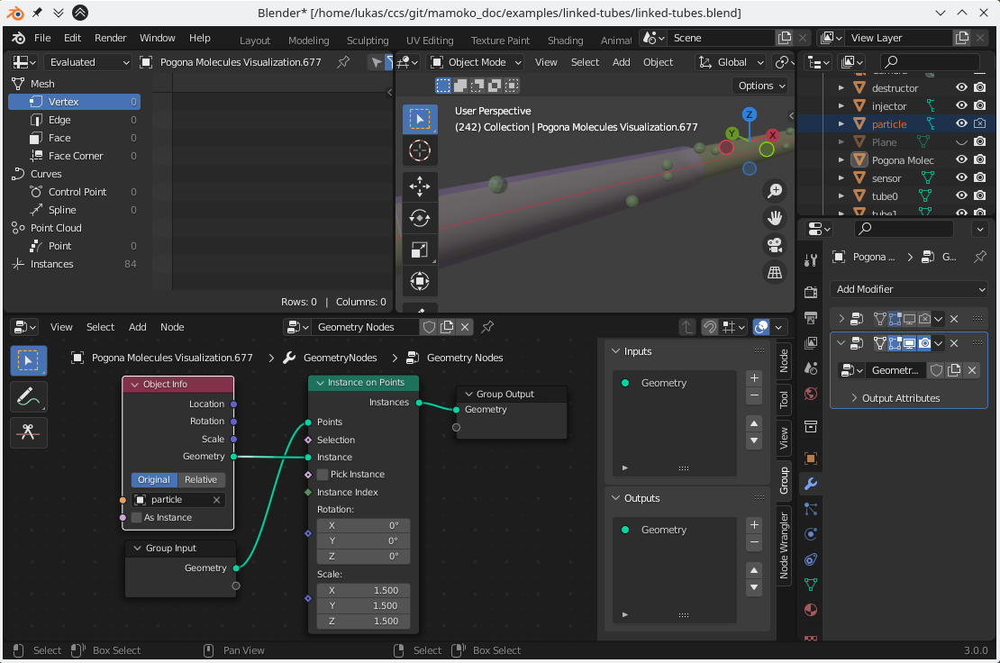
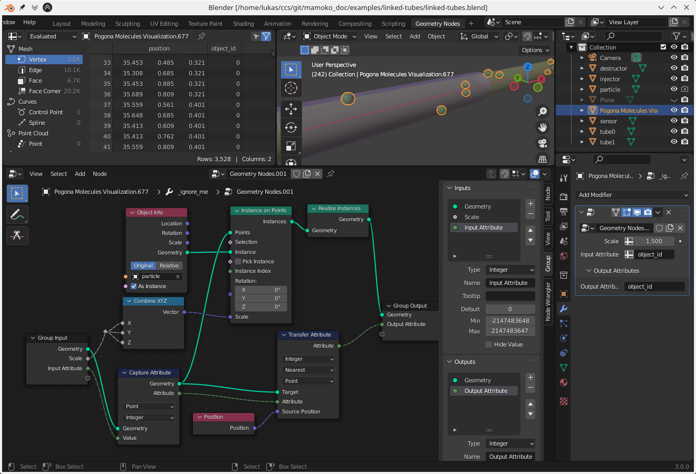

Visual Debugging
================

Not all potential issues in a simulation scenario can be caught in the simulation itself.
A first approach for visual debugging is already presented in the chapter on :ref:`Running a Simulation <running>`, namely inspecting the movement of particles through the scene using Blender.
We will expand on this approach below.

Please note: Some steps are only supported with Blender versions 3.0.0 or higher and with the Cycles render engine enabled.

Points to Spheres with Geometry Nodes
-------------------------------------

If you have tried to render the animation of the previous chapter, you may have noticed that the particles are invisible.
This is because, for now, each particle is only a vertex in a mesh without any surfaces.
Blender supports a couple of ways to make these vertices visible, but the most flexible option is to instance a copy of some reference object, like a sphere, at each of the points using Geometry Nodes.

First, create an object to represent each of your particles (for example, an Ico Sphere).
Optionally, hide this object in the Outliner window both for the viewport and for renders – otherwise, it may later be confusing to always have one stationary particle in the scene.

    Blender Screenshot: Instancing a sphere for each particle.

Next, open a Geometry Nodes Workspace (click on the '+' in the tab bar at the very top).
In the middle of the workspace, click "New" to add a new Geometry Node graph.
To instantiate your particle object at each of the visualization's particle positions, add a new Instance on Points node, connect it to the Group Input and Output, and provide your particle object accordingly.
Depending on the size of your original particle object, your particles may be too large or too small.
Scale your particle object in edit mode to an appropriate size or adjust the scale in the Instance on Points node.

Importing Particle Attributes
-----------------------------

With your Pogona Molecules Visualization instance selected, look again at the Pogona Molecules Visualization properties in the Object Properties panel.
Below the Time Step field, you should see an empty list and a button for adding a new attribute.
You can import any of the columns in you particle positions CSVs as attributes.
In this example, we will use the ``object_id`` to visualize which Pogona Object a particle "thinks" it belongs to.
Click the "Add" button, enter ``object_id`` as the attribute name to import, and choose the type ``Integer``.

    Blender Screenshot: Importing a CSV column as an attribute.

Note: If you want to import a vector, you must either import each column separately or ensure that the 3 columns are named in the format ``"<variable name>_<axis>"`` (for example, ``"velocity_x"``).
String-valued attributes are as of now unsupported by Blender's Geometry Nodes.
As a workaround, you can select "Hashed String" to generate a unique integer for every different string.

Playing back the animation in the example scenario, you should now see a new column ``object_id`` in the spreadsheet window and its values changing as particles move from one tube to the next.
You can already use this attribute to give each particle a different size depending on the ``object_id``, for example.
However, we want to use color to convey this information.

Visualizing Particle Attributes with Color
------------------------------------------

Before we can use the ``object_id`` in a shader to control the color of each particle, we must first 'transfer' the attribute.
This is because originally, the attribute is only assigned to the individual vertices at the original particle positions, but not automatically adopted to each instance when using the Point Instance node.

To solve this, the ``object_id`` attribute first has to be captured for use with Geometry Nodes.
Add a Capture Attribute node, connect its Geometry input with the Geometry output of the Group Input node, set the Value field to Integer (because ``object_id`` is Integer-valued), and connect its Value socket to the empty circle of the Group Input node.
At this point, you can go into the Modifiers tab, click the Input Attribute Toggle button next to your newly added input and enter ``object_id``.
After instancing the spheres on the original particle positions, the instances have to be merged into a new mesh by using a Realize Instances node after the Instance on Points node.
Now, add a Transfer Attribute node, connect the Target input to any Geometry output before the Instance on Points node, choose ``Integer``, ``Nearest``, and ``Point`` to adopt the ``object_id`` integer at the nearest vertices of the instanced mesh.
Connect the Attribute input of the Transfer Attribute node to the corresponding output of the Capture Attribute node, use a new Position node for the Position socket, and connect the output Attribute to a new socket on the Group Output node.
Finally, go back to the Modifiers tab and also enter ``object_id`` into the field for your output attribute.

    Blender Screenshot: Transferring an attribute to instanced particles.

At this point, we are able to use the ``object_id`` in a shader, so switch to a Shading workspace.
Begin by adding some lights and giving the tubes in the example scenario some transparent materials so we can see the particles inside them.

.. figure:: ../img/getting-started_vis-debug_blender_lights-and-materials.png

    Blender Screenshot: Tubes shown at their interconnection point with transparent Principled BSDF materials.
    There is not material applied to the particles themselves yet.

Finally, select your single particle (not the Pogona Molecules Visualization with the instanced particles) and give it a new material.
Add a new Attribute node, set its Type to Geometry and its Name to ``object_id``.
As a precaution for at some point having more than 2 objects, add a MapRange node and change its From Max value to the number of possible objects minus 1.
Then connect its input to the Attribute's Fac output (since ``object_id`` is 1-dimensional) and route its output through a ColorRamp into the Base Color input of the Principled BSDF node (and optionally into the Emission input).

    Blender Screenshot: Particle shader for coloring each particle depending on its ``object_id``.
